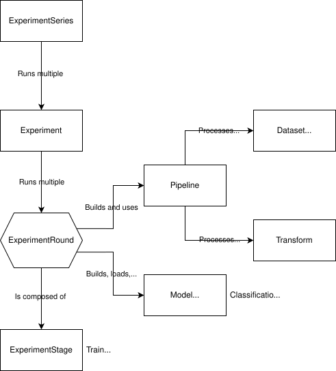

# Mindful-Core
Medical ImagiNg Data FUsion Lab

[](https://doi.org/10.5281/zenodo.20579796)

Mindful is a library mainly built on top of PyTorch, SimpleITK and MONAI to built classification and segmentation models of medical images. Mindful is a modular and reproducible framework for AI experimentation in medical imaging, supporting both classification and segmentation tasks. The platform serializes all experiment settings (models, preprocessing, datasets, random seeds, etc.) to ensure reproducibility, provides cross-validation-based evaluation, and enables experiment configuration through simple JSON files. Its extensible architecture allows rapid integration of new models, training methods, preprocessing pipelines, and evaluation metrics with minimal code changes.

Powered by:
- [](https://pytorch.org/) ([](https://opensource.org/licenses/BSD-3-Clause))
- [](https://github.com/SimpleITK/SimpleITK) ([](https://opensource.org/licenses/Apache-2.0))
- [](https://github.com/project-monai/monai) ([](https://opensource.org/licenses/Apache-2.0))

Looking for the Mindful extension for the **SUBREAM** project? check it out [here](https://github.com/heds-trm/mindful_subream)!

## Project installation
Follow instructions in `INSTALL.md`. See the [Examples](#examples-) section to test your environment.

## Project Structure

### Table of Content
- [main.py](#mainpy)
  - Entry point
- [Experiments](#experiments-)
  - Functional heart of the project
- [Models](#models-)
  - Models, architecture and losses 
- [Data](#data-)
  - Data folds and pipelines 
- [Analysis](#analysis-)
  - Statistics and interpretability
- [Scripts](#scripts-)
  - Auxiliary scripts (data preparation, bootstrapping, ...)
- [Utils](#utils-)
  - Utility functions used across the project
- [Examples](#examples-)
  - Examples of application of the project, will be updated over time

### main.py
This is the main entry point of the project and will start a series of experiments based on the configuration file. (see [Experiments](#experiments-))

### Experiments ([🔝](#mindful-core))
To automate experiments and fold-by-fold experimentation, experiments use the following hierarchy:
`ExperimentSeries > Experiment > ExperimentRound > ExperimentStage`

#### 1. ExperimentSeries
*ExperimentSeries is a set of Experiment (N=number of experiments described in the configuration).*

[ExperimentSeries](experiments/experiment_series.py) uses the main configuration to automatically chain experiments described in the configuration. Its role is both to iterate through the experiments and dynamically update the configs of these experiments. For example, ExperimentSeries will share the same root folder for all its experiments which will be logged within their own separate subfolders in this root folder. ExperimentSeries will make sure seeds used by Experiments are the same.

#### 2. Experiment
*Experiment is a set of ExperimentRound (N=number of folds).*

[Experiment](experiments/experiment.py) will start experiment rounds which can train, validate, test, ... individual models. The key difference between Experiment and ExperimentRound is that Experiment will run as many ExperimentRound as needed based on the number of folds in the experiment. Experiment will make sure the seed used by each ExperimentRound (fold) is different.

#### 3. ExperimentRound
*ExperimentRound is a set of ExperimentStage (N=number of stages in config).*

__[ExperimentRound](experiments/experiment_round.py) is the heart of this project.__ It will create models, data pipelines, load data folds, ... based on the configuration it receives. Most commonly, ExperimentRound will run the training and test stages, as well as run any interpretability or additional stages. 

Here is a diagram of how the project articulates around ExperimentRound:


#### 4. ExperimentStage
[ExperimentStage](experiments/experiment_stage.py) is only a registry of stages the ExperimentRound must perform and contain very little data by themselves. This class mainly exists for allowing future versions to add data to configure stages.

### Models ([🔝](#mindful-core))

#### 1. MindfulModule ([🔝](#models-))
[MindfulModule](models/module.py) is an abstract class and the root of any model class supported by this project. It will mainly configure handles for the loss function and optimizers.
By themselves, MindfulModule do not define any architecture, task or expected inputs/outputs and can therefore be derived for any use.

Classes that inherit from MindfulModule also benefit from being added to a registry, which allows the project to automatically recognize any class/model imported in the project as a valid model to create or load.

#### 2. ModelOutput ([🔝](#models-))
[ModelOutput](models/model_output.py) defines all the supported model outputs (classification, segmentation, bounding boxes, ...) and gives an interface to help manipulate these outputs.

#### 3. AbstractClassifier ([🔝](#models-))
[AbstractClassifier](models/classification/abstract_classifier.py) is an abstract class and the root of any classification model. 
AbstractClassifier defines the base classification by itself, depending on the arguments used to build the instance.
The architecture and the forward function are left to subclasses. The forward function of subclasses must return a valid ClassifierOutput instance (see [ModelOutput](#2-modeloutput-)).

The classification models available in this project are:
- [MonaiClassifier](models/classification/monai_classifier.py): a basic bridge between the Mindful project and MONAI. See the `make_monai_classifier` method for supported architectures.
- [TargetModel](models/classification/target_model.py): a classification model in two parts. The first part is any encoder that output a 1D representation and the second an MLP projecting the representation to class logits.
- [EnsembleClassifier](models/classification/ensemble/ensemble_classifier.py): an ensemble model aggregating the logits of multiple models.

The TargetModel is the main way to customize the model's architecture through its representation model.

#### 4. Encoders ([🔝](#models-))
The encoder architectures available in this project are:
- [ViTEncoder/SwinEncoder](models/representation/encoders/vit_encoder.py) (unimodal &ndash; images): project 2D or 3D images to a sequence of 1D vectors (or a single vector) using transformer encoders. The SWIN variant is available in the same folder.
- [VGGEncoder](models/representation/encoders/vgg.py) (unimodal &ndash; images): project 2D or 3D images to a 1D vector. Based on CNNs.
- [ScalarEncoder](models/representation/encoders/misc/scalar_encoder.py) (unimodal &ndash; scalars): project scalars from input to representation space. Based on MLP with ReLU activations. 
- [CategoricalEncoder](models/representation/encoders/misc/categorical_encoder.py) (unimodal &ndash; integers): builds and uses a look-up table matching indices to learn embeddings.  Then proceeds as ScalarEncoder using these embeddings.
- [MultiModalEncoder](models/representation/encoders/multimodal/multimodal_encoder.py) (multimodal &ndash; any modality): Uses the specified unimodal encoders to get unimodal representations and then merge these representation with its fusion module (see [FusionModule](models/representation/encoders/multimodal/fusion_module.py) and [FusionTransformer](models/representation/encoders/multimodal/fusion_transformer.py)).

#### 5. AbstractRepresentationModel ([🔝](#models-))
[AbstractRepresentationModel](models/representation/abstract_representation_model.py) is an abstract class and the root of any representation model.
Contrarily to its AbstractClassifier counterpart, it does not define a base loss but provide a Variance/Covariance loss function originally defined in the VICReg paper.
Subclasses must also implement the forward function, which must return a RepresentationOutput instance (see [ModelOutput](#2-modeloutput-)).

AbstractRepresentationModel can be used for training encoders using SSL (either as a pre-training phase, or for extracting representations).

The representation models available in this project are:
- [DINO](models/representation/dino.py): based on the paper `Emerging Properties in Self-Supervised Vision Transformers`. DINO stands for "self-distillation with no labels". DINO uses two sub-models, the student encoder we're training and a teacher network with the same architecture whose parameters are computed as the Exponential Moving Average of the student encoder. The student is trained to make predictions similar to the teacher's predictions.
- [VICReg](models/representation/vicreg.py): based on the paper `VICReg: Variance-Invariance-Covariance Regularization for Self-Supervised Learning`. The model is trained to produce the same representation for two views of the same input. Variance forces representation within a single batch to be different. Invariance attracts representation to be the same for the same input. Covariance decorrelates variables of each representation to prevent information collapse.


#### 6. AbstractSegmentationModel ([🔝](#models-))
[AbstractSegmentationModel](models/segmentation/abstract_segmentation_model.py) is an abstract class and the root of any segmentation model.
Similarly to AbstractClassifier, AbstractSegmentationModel defines the base loss function and leaves the forward function to subclasses. The forward function must return a SegmentationOutput instance.

At the moment, the only working subclass of AbstractSegmentationModel is [SegmentationUnet](models/segmentation/segmentation_unet.py). This UNet can use either the basic UNet backbone, or the backbone of either UNetr or SWIN-Unet.

### Data ([🔝](#mindful-core))

#### 1. MindfulDataset and DataFold ([🔝](#data-))
MindfulDataset relies on the DataFold class to provide the list of samples and their associated fold. 
DataFold - and its child class PresetFold - load and list samples, which include their ID, image path(s), label, scalar data, categorical data, ...

Using a sampling strategy, its samples and a [Pipeline](#3-pipeline-), a MindfulDataset builds a DataLoader - a PyTorch object - used for training, testing, and various cases where data has to be loaded.

#### 2. Transform ([🔝](#data-))
Transforms are a collection of classes used for processing data.
Transforms can either be unimodal or multimodal.
Some transforms will expect specific modalities (e.g. transforms in data/transforms/imaging.py usually expect images).
Transforms can either be deterministic or stochastic (in this later case, transforms are seeded).

The [SerializableTransform](data/transforms/serializable_transform.py) class can be easily derived to add new transforms to the project.
Its abstract methods will ensure transforms will be serializable and therefore can be saved with other logged data.
SerializableTransform subclasses can also be fitted before training (on the training data), which can be useful to process data based on the population's statistics.

#### 3. Pipeline ([🔝](#data-))
[Pipeline](data/transforms/pipeline.py) instances are a collection of staged lists of transforms.
Stages are used to automatically differentiate training, validation and test pipeline.
Once differentiated, pipelines will run through each transform one by one, updating a dictionary of modalities at each step.

In the special case of multiview pipeline (e.g. for VICReg), some stages will run as many times as the number of views that are expected.

### Analysis ([🔝](#mindful-core))

#### 1. Statistics
The role of the [statistics folder](analysis/statistics) is mainly to compute metrics for models, such as AUROC, EER, accuracy, etc.
It also extends these metrics for models with confidence estimation. For default classification metrics, see [AbstractClassifier](models/classification/abstract_classifier.py)'s \_\_init\_\_ function.

For bootstrapped metrics, see the [compute_bootstrapped_metrics.py](scripts/outcomes/compute_bootstrapped_metrics.py) script.

#### 2. Visualization
The [Visualizer](analysis/visualization/visualizer.py) class and its subclasses are intended for interpretability.
[VisualizerGroup](analysis/visualization/visualizer_group.py) gives an interface to run multiple visualizers are once.

Visualizers include - for both images and scalar data - attention, occlusion and saliency maps. They also include CAM and segmentation maps for images.

To use, enable the "visualize" ExperimentStage. The default visualizers can be found in [VisualizerGroup](analysis/visualization/visualizer_group.py)'s `get_default_visualizers_config` function.

### Scripts ([🔝](#mindful-core))
This folder contain all scripts that can be run on their own. See their \_\_main\_\_ function for expected arguments (defined by the argparse library).

### Utils ([🔝](#mindful-core))
This is a collection of utility code used throughout the project.

### Examples ([🔝](#mindful-core))
This is a collection of [examples](./examples/README.md) using the library.

## Contributors and roles ([🔝](#mindful-core))

Contributor metadata is available in:
- `CITATION.cff` for citation metadata
- `CONTRIBUTORS.md` for detailed roles and contributions

## Versioning ([🔝](#mindful-core))

This project follows [Semantic Versioning 2.0.0](https://semver.org/).

Given a version number MAJOR.MINOR.PATCH:

- MAJOR version for incompatible API changes.
- MINOR version for backward-compatible functionality.
- PATCH version for backward-compatible bug fixes.

To get the current version in your code:
```
import mindful_core
print(mindful_core.__version__)
```

> [!NOTE]
> The version is written in `version.py` by maintainers at every release from the `pyproject.toml` file.

## Funding ([🔝](#mindful-core))

This project has been funded by: 
- HES-SO R&I - Open Research Data call 138082/RI-STRATEGIE25-03)
- [Geneva Health Innovation Technologies (Geneva HIT)](https://www.hesge.ch/heds/geneva-health-innovation-technologies-hit) with the support of [Geneva School of Health Sciences (HEdS)](https://www.hesge.ch/heds/) and the [University of Applied Sciences and Arts Western Switzerland (HES-SO) - Geneva](https://www.hesge.ch/geneve/en)


