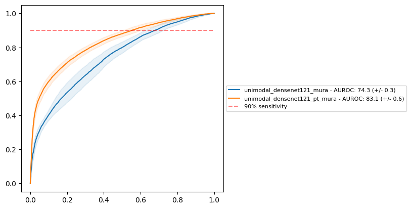

# Introduction

The [MURA](https://stanfordmlgroup.github.io/competitions/mura/) dataset is a publicly available collection of X-Ray images of upper extremities classified as "positive" or "negative", positive indicating the presence of abnormal, pathological signs. This example illustrates how mindful can be used to perform image classification. It is not designed to be efficient in terms of performance.

## Preparation

### MURA dataset download and unzip
In a folder, which we will refer to as `<mura_data>`, unzip the archive `MURA-v1.1.zip` from the [link](https://stanfordaimi.azurewebsites.net/datasets/3e00d84b-d86e-4fed-b2a4-bfe3effd661b) provided in the "Downloading the Dataset (v1.0) section" of MURA dataset [homepage](https://stanfordmlgroup.github.io/competitions/mura/), adapt it if it has changed. This will result in `train` and `valid` folders.

Also create a folder for the experiments, referred to as `<exp_data>`.

### Fold config files
In Mindful, we strongly advise to use cross-validation to provide a fair evaluation of algorithms and experiments. To create config files describing the folds of the MURA dataset, splitting its data in train/validation/test subsets, use the following script resulting in a 5-fold split (run it from `mindful_core/examples/mura`folder):

```
python ./make_mura_folds.py --data-root <mura_data>/train --output-dir <exp_data>/folds --k 5 --seed 666
```

Check that you folder `<exp_data>/folds` contains 5 files named `mura_fold_00.csv`, `mura_fold_01.csv`, etc.

### Experiment config files

An Experiment uses config files that mainly describe:
- the dataset
- the model with parameters
- the training strategy with hyperparameters
- the pipeline to preprocess the data
- the stages (train, test)

Multiple experiments can be present in a same config file, the user can turn them on and off.

The following script will create the configuration, split in several `.json` files for clarity. Indeed, a single config file would be possible but by having files separated we keep things better organized. 

```
python ./make_mura_configs.py --output_dir <exp_data>/config --folds_dir <exp_data>/folds --pipelines_dir <exp_data>/config/pipelines --models_dir <exp_data>config/models --runs_dir <exp_data>/config/runs --logs_dir <exp_data>/logs
```

Output folders are automatically created. Folder `<exp_data>/logs` will contain the future output of the experiments.

> [!NOTE]
> You will find additional information on configuration files [here](./MURA_EXPERIMENT_CONFIGURATION.md).

### Running experiments

Experiments can be run with the following command line:

```
python -m mindful_core.main --config <exp_data>/config/runs/config_run.json
```

You must run it in the folder containing the folder `mindful_core` (which contains `main.py`). 

Main config file `config_run.json` states which experiments are set to be run if their `skip` flag is set to `no` (default). Currently two experiments are proposed:
- _unimodal_densenet121_mura_: 5-fold classification of positive and negative samples using a Densenet 121 model.
- _unimodal_densenet121_pt_mura_: same but using a pretrained Densenet model. 

Both experiments are mostly identical, with the only difference that we must specify the use of pretraining in the second one. This is done by specifying different config file for hyper parameters for the model in the experiment section of `config_run.json`: 

```
"hparams": "<models_dir>/densenet121_hparams.json"
                      -vs-
"hparams": "<models_dir>/densenet121_pt_hparams.json"
```

where `"pretrained": true` can be found in `<models_dir>/densenet121_pt_hparams.json`.

Produced training files (tensorboard files, `.ckpt` checkpoints, etc.) will be placed in `<exp_data>/logs/<experiment_name>`. 

### Inspecting the results

The log folder will also contain information on the testing phase of the experiments in various files. Among them, `formatted_summary.csv` provides an overview of the performances of the experiments over the various folds. We can see for instance that for experiment `unimodal_densenet121_mura` performances were:
- Area under the ROC curve (AUC) at EER: 74.3 +/- 0.3%
- Accuracy at EER: 66.9 +/- 0.3%
- Sensitivity at EER: 66.9 +/- 0.3%
- Specificity at EER: 67.0 +/- 0.3%

Results also highlight that the pretrained model has better performance with an AUC of 83.1 +/- 0.6%. 

> [!NOTE]
> Results of all experiments are available [here](./doc/unimodal_formatted_summary.csv) in case you would like to compare your training with ours.
> Despite you use our configuration files to ensure a deterministic behaviour of the training, we found that software updates in e.g. PyTorch or MONAI
> could lead to differences, hopefully not significant.

EER stands for "Equal Error Rate", and it means that metrics were computed with a decision thresholds were specificity and sensitivity are almost equal.

If you would like to produce ROC curves for your experiments, you can use the script [draw_roc_comparisons.py](../../scripts/outcomes/draw_roc_comparisons.py):

```
python -m mindful_core.scripts.outcomes.draw_roc_comparisons <exp_path>/config/runs/config_run.json --sensitivity_thresholds 0.9 
```

This script must be called from the folder containing the `mindful_core`directory. Curves of chosen experiments will be output in a same ROC figure located in the config folder and named after the config filename. For instance:



Solid line is the average over the folds, while the transparent area indicates the variation around the average.

The dashed line at 90% sensitivity can be removed in the command line if necessary. By default this command will include all experiments in the ROC figure, regardless their `skip` value in the config file. To change that, use the `--skip-experiments` option in the command line. 
